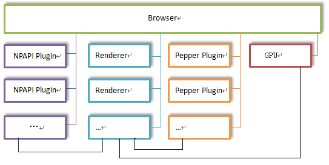

[TOC]

## CEF3多进程模型

### 1. CEF3进程类型

CEF3是一个多进程架构框架，进程主要分为四类：

- Browser进程。
  - CEF3的主进程，负责窗口管理，界面绘制和网络交互。主进程只有一个。
- Renderer进程。
  - CEF3渲染进程，负责Blink的渲染和Js的执行，Js Binding和对Dom节点的访问。默认情况下程序会为每个标签页创建一个新的Render进程。
- GPU进程。
  - 当开启GPU硬件加速打开的时候会被创建，主要用于对3D加速调用的实现。最多只能有一个。
- Plugin进程。
  - CEF3的插件进程，例如NPAPI，PPAP或者Pepper插件。每种类型的插件只会有一个进程，每个插件进程可以被多个Render进程共享。

默认情况下，CEF3进程启动流程如下：

1. 程序启动，主进程`browser-process`被创建。
2. 主进程重新启动程序，携带命令行参数启动其他进程。

### 2. CEF3多进程模型图



### 3. 多进程优点

多进程的好处很多，在浏览器中最主要的好处是当一个页面或者插件崩溃或假死，不会给其他页面带来影响。

CEF3的进程之间可以通过IPC进行通信。`Browser`和`Render`进程可以通过发送异步消息进行双向通信。甚至在`Render`进程可以注册在`Browser`进程响应的异步`JavaScript API`。在CEF3中，`Browser`和`Render`进程间可以通过`SendProcessMessage(CefProcessId target_process,  CefRefPtr<CefProcessMessage> message)`函数实现消息传递。

### 4. CEF3多线程

在CEF3中，每一个进程都会运行着多个线程。具体定义在`include/internal/cef_types.h`，一共有八类线程：

```c++
typedef enum {
  // BROWSER PROCESS THREADS -- Only available in the browser process.

  ///
  // The main thread in the browser. This will be the same as the main
  // application thread if CefInitialize() is called with a
  // CefSettings.multi_threaded_message_loop value of false.
  ///
  TID_UI,

  ///
  // Used to interact with the database.
  ///
  TID_DB,

  ///
  // Used to interact with the file system.
  ///
  TID_FILE,

  ///
  // Used for file system operations that block user interactions.
  // Responsiveness of this thread affects users.
  ///
  TID_FILE_USER_BLOCKING,

  ///
  // Used to launch and terminate browser processes.
  ///
  TID_PROCESS_LAUNCHER,

  ///
  // Used to handle slow HTTP cache operations.
  ///
  TID_CACHE,

  ///
  // Used to process IPC and network messages.
  ///
  TID_IO,

  // RENDER PROCESS THREADS -- Only available in the render process.

  ///
  // The main thread in the renderer. Used for all WebKit and V8 interaction.
  ///
  TID_RENDERER,
} cef_thread_id_t;
```

CEF3提供了几个宏来判断当前的线程，定义在`include/wrapper/cef_helpper.h`

```c++
#define CEF_REQUIRE_UI_THREAD() DCHECK(CefCurrentlyOn(TID_UI));
#define CEF_REQUIRE_IO_THREAD() DCHECK(CefCurrentlyOn(TID_IO));
#define CEF_REQUIRE_FILE_THREAD() DCHECK(CefCurrentlyOn(TID_FILE));
#define CEF_REQUIRE_RENDERER_THREAD() DCHECK(CefCurrentlyOn(TID_RENDERER));
```